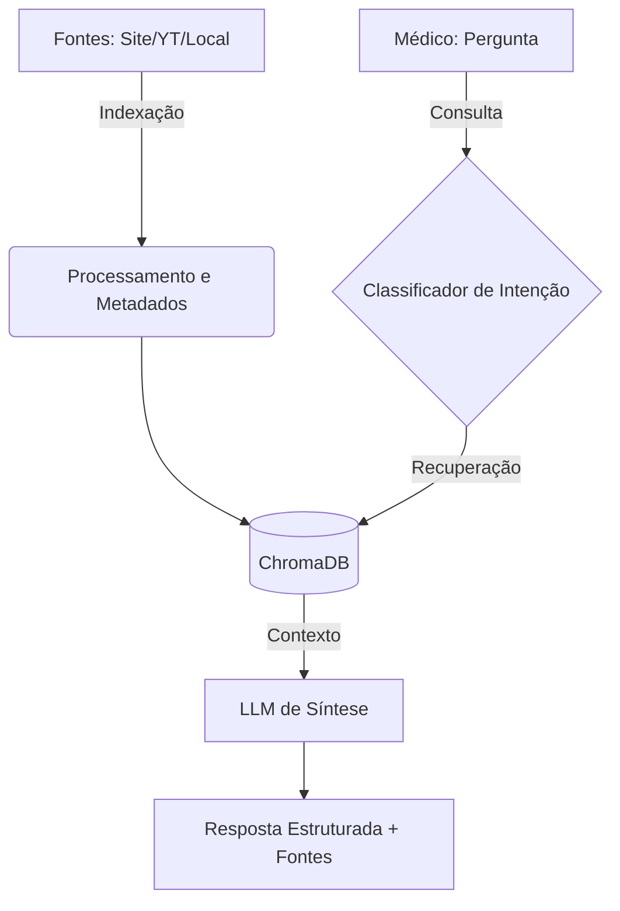

# 🏗️ Arquitetura Geral do superRAG

Se você abrir o capô do superRAG, verá um sistema elegantemente dividido em dois ciclos de vida principais. Pense nisso como uma **fábrica**: temos a linha de montagem (Indexação) e o balcão de atendimento (Consulta).

---

## 1. O Ciclo de Vida do Conhecimento (Indexing)

Não adianta ter uma IA potente se ela não tem dados de qualidade. O pipeline de indexação é responsável por:
1. **Ingestão:** Capturar artigos do site, transcrições do YouTube ou arquivos locais.
2. **Processamento:** Limpar o "ruído" (músicas, repetições, lixo de HTML).
3. **Enriquecimento:** Usar LLMs rápidos para gerar metadados clínicos (especialidade, medicamentos, temas).
4. **Vetorização:** Transformar texto em números (embeddings) para que o banco de dados possa "entender" o significado.
5. **Persistência:** Salvar no [[04_🛠️_Pilha_Tecnica#ChromaDB|ChromaDB]].

Para detalhes minuciosos, veja: [[02_📥_Pipeline_de_Indexacao|Pipeline de Indexação]].

---

## 2. O Ciclo de Vida da Pergunta (Querying)

Quando o médico faz uma pergunta, o sistema não vai direto para a resposta. Ele segue um protocolo rigoroso:
1. **Classificação:** A pergunta é clínica? É geral? É sobre algo que temos na base?
2. **Busca Semântica:** Recuperamos os trechos (*chunks*) mais relevantes do banco vetorial.
3. **Síntese Potente:** O modelo mais forte (Llama 3.3 70B) lê os trechos e redige a conduta clínica.
4. **Citação de Fontes:** O sistema mapeia cada dado à sua origem.

Para entender a "mágica", veja: [[03_🧠_Pipeline_de_Consulta|Pipeline de Consulta]].

---

## 🧩 Visualizando o Fluxo

---
[[00_🏠_Home|⬅️ Voltar para Home]] | [[02_📥_Pipeline_de_Indexacao|Próximo: Pipeline de Indexação ➡️]]
